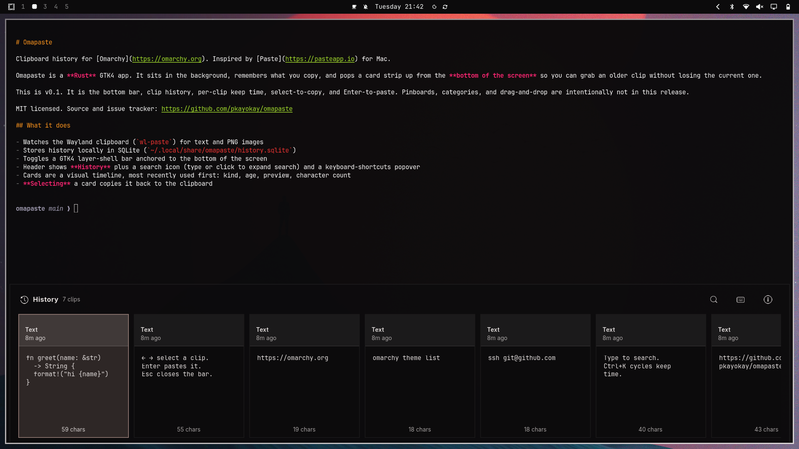

# Omapaste

Clipboard manager for [Omarchy](https://omarchy.org). Inspired by [Paste](https://pasteapp.io) for Mac.



It watches what you copy and summons a bottom card bar so you can grab an older clip without losing the current one.

## What it does

- Watches the Wayland clipboard (`wl-paste`) for text and common image types (PNG, JPEG, WebP, …)
- Stores history locally in SQLite under `~/.local/state/omapaste/`
- Bottom layer-shell card strip (most recent first): kind, age, keep, preview, character count
- **Selecting** a card copies it; **Enter** (or double-click) pastes into the window that was focused before the bar opened
- **Drag** a card into another app (text or images; terminals and text fields get a path/URI)
- Double-click a kind label to rename; per-clip keep time (1h / 1d / 7d / forever) and search
- Follows the current Omarchy menu theme tokens
- Skips password-manager / secret MIME types

## Install

```bash
omarchy plugin add https://github.com/pkayokay/omapaste.git --enable
```

System packages (usually already on Omarchy):

```bash
sudo pacman -S --needed wl-clipboard wtype python jq
```

Optional Hyprland toggle (**Super+Shift+V** — edit yourself; the plugin never rewrites Hyprland config):

```lua
-- ~/.config/hypr/bindings.lua
o.bind("SUPER + SHIFT + V", "Omapaste", "omarchy-shell shell toggle io.github.pkayokay.omapaste '{}'")
```

Keep **Super+Ctrl+V** for Omarchy’s built-in clipboard picker.

Full install / update / remove: [docs/omarchy-plugin.md](docs/omarchy-plugin.md). Config: [docs/configuration.md](docs/configuration.md).

## Usage

Summon via the bind above, or:

```bash
omarchy-shell shell summon io.github.pkayokay.omapaste '{}'
```

| Input | Action |
| --- | --- |
| Super+Shift+V (if bound) | Toggle the bar |
| ← → | Select a clip (also copies it) |
| Click a card | Select and copy |
| Drag a card | Drop into another app |
| Ctrl+C | Copy the highlighted clip and close |
| Enter or double-click | Paste into the previous window and close |
| Ctrl+1–9 | Paste that card |
| Delete or Backspace | Remove the highlighted clip (Backspace edits search if it has text) |
| Ctrl+K | Cycle keep time (1h → 1d → 7d → forever) |
| Double-click kind label | Rename |
| Type | Search |
| Clear (✕) while searching | Clear the search query |
| `?` | Shortcut list |
| `↗` | Open the GitHub issue tracker and close |
| Esc | Close shortcuts, then search, then the bar |

## Why not the built-in Omarchy clipboard?

Omarchy’s Super+Ctrl+V picker is a vertical list that copies onto the clipboard. Omapaste is the Paste.app-shaped alternative: a bottom card timeline, per-clip retention, drag into apps, and paste-on-Enter into the app you were already in.

## Docs

| Doc | Contents |
| --- | --- |
| [docs/omarchy-plugin.md](docs/omarchy-plugin.md) | Install, update, remove, Hyprland bind |
| [docs/configuration.md](docs/configuration.md) | `qml-config.json`, data paths |
| [CHANGELOG.md](CHANGELOG.md) | Release notes |

## Issues

Bugs, ideas, and patches: [github.com/pkayokay/omapaste/issues](https://github.com/pkayokay/omapaste/issues).

## License

MIT
